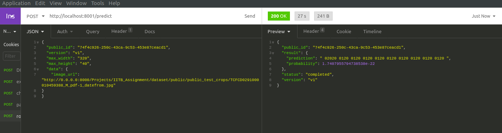
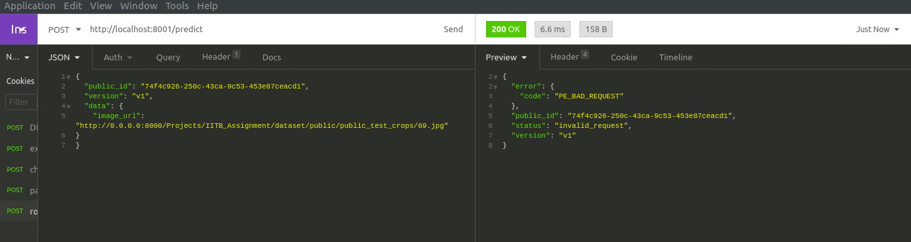

# Handwritten Form Reader

This OCR pipeline attempts to detect text in a cropped handwritten forms. In order to convert cropped form data to text, synthetic data of the required type was generated and trained using a modified version of the attention OCR model.<br>

<br>
```Sample prediction on real data```


To reproduce the results of the pipeline on test data kindly refer ```instructions.txt``` and for a details about the analysis, comparison and hyperparameter tuning of the neural network refer ```report.pdf```. A log report, ```log.md``` has also been included in this repository which constains succinct description of  daily work done.

## Folder Structure
---
Find the folder tree below. Note that some details have been omitted for brevity and can be found in the respective repositories of the source code, kindly refer a separate ```README.md``` in such cases.
```
Root<br>
|
| .gitignore
| requirements.txt
| log.md
| README.md
| MANIFEST.in
| setup.py
| instructions.md
| myrun.sh
| Report.pdf
|
|___aocr
|   |
|   | __main__.py
|   | __init__.py
|   | defaults.py
|   | LICENSE.md
|   | README.md
|   |
|   |____model
|   |    |
|   |    | __init__.py
|   |    | cnn.py
|   |    | model.py
|   |    | seq2seq.py
|   |    | seq2seq_model.py
|   |
|   |____util
|        | 
|        | __init__.py
|        | bucketdata.py
|        | data_gen.py
|        | dataset.py
|        | export.py
|        | visualizations.py  
|     
|___text_renderer
|   |
|   | main.py
|   | README.md
|   | setup.py
|   |
|   |____dataset_labels
|   |    |
|   |    | convert_labels.py
|   |
|   |____ocr_data
|   |
|   |____example_data
|   |
|   |____text_renderer
|   |
|   |____tools
|   |
|   |____docs
|   |
|   |____docker
|   
|
|____experiments
|   |
|   | TestSyntheticDataGen.ipnb
|   | Tfwriter.ipnb
|   | Train.ipnb
|   
|____checkpoints
|   
|____app
|   
|____datasets
|   
|____utils
|


```
1. The folder ```aocr``` contains the main code for the attention ocr along with a separate ```README.md``` which can be used as a reference. 
2. The folder ```text_renderer``` contains the code used for generation of synthetic dataset. The exact details of configuration used is inside ```text-renderer/ocr_data/gen_data.py```.
3. Since this model was trained and tested on Google Colab, sample ```ipnb``` files have been provided for reference in ```experiments```.
4. And the app folder contains the flask based REST API for testing the endpoints
5. The model checkpoints are located in the checkpoints directory
6. Please read ```Report.pdf``` for a detailed summary of work done!


## Reproduce results on local machine
---
In order to run the app on your local machine follow these steps:
1. Clone the repository on your local machine:<br>

    ```git clone https://github.com/java-abhinav07/abhinav_java_9873155323-IITB-Assignment-Jul-Dec2020-Batch2.git```

2. Install aocr locally using ```setup.py```:<br>

    1. ```cd abhinav_java_9873155323-IITB-Assignment-Jul-Dec2020-Batch2```
    2. ```pip(3) install -e ./``` <br>

3. Install necessary packages:<br>

    ```pip3 install -r requirements.txt```
4. Having installed all the packages run:
   ```python3 app/app.py```<br>
   This will run the server on the local machine on port **8001**(note that CPU inference might take upto 14 seconds to process)
5. Send the request to localhost as follows:
   1. Correct API Spec:<br>
        <br>
        ```
        {
            "public_id": "74f4c926-250c-43ca-9c53-453e87ceacd1",
            "version": "v1",
            "max_width": "320",
            "max_height": "40",
            "data": {
                "image_url": "http://0.0.0.0:8000/Projects/IITB_Assignment/dataset/public/public_test_crops/TCFCD0291000010459388_M_pdf-1_datefrom.jpg"
            }
        }
   2. Incorrect API Spec:<br>
        <br>

6. Response Status will either be ```completed``` or ```invalid request``` to indicate a successful or unsuccessful response respectively.


## Inference on Local Machine
---
To execute inference on your local machine you can also use the bash script provided as follows:<br>
```./my_run.sh TestImageFolderPath Output.txt```<br>

Subsequently the output file ```output.txt``` will have output:<br>
```<Testimagefilename1> <recognized text> <Testimagefilename2> <recognized text>```


## Access Heroku App
---
Inorder to run request over a public web server use the following path:<br>
```https://formreader.herokuapp.com/predict```<br>

Use the same API Spec shared above in order to fetch the results.<br>
Kindly note that the public formreader might not work extremely efficiently due to CPU inference provided by Heroku. **It is recommended to use a GPU for inference since Heroku times out all requests after a certain time.**


## References
---
This repository contains code from the following two repositories:<br>
1. https://github.com/emedvedev/attention-ocr : aocr
2. https://github.com/oh-my-ocr/text_renderer : text_renderer

The reports contains a list of papers which were referenced during the design of this ocr rendition.
